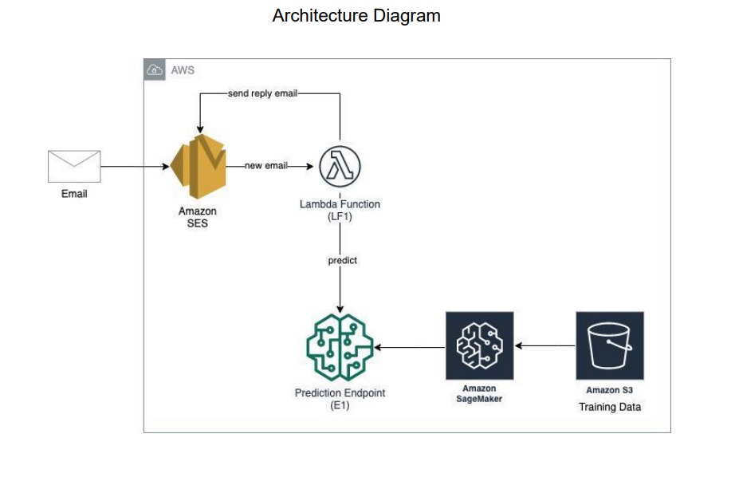

# Spam Classification
Implemented a machine learning model to predict whether a message is spam or not. Created a system that upon receipt of an email message, it will automatically flag it as spam or not, based on the prediction obtained from the machine learning model.

### Services/ Technologies:
- AWS SageMaker
- AWS S3
- AWS SES
- AWS Lambda
- AWS CloudFormation

### Architecture:

  

